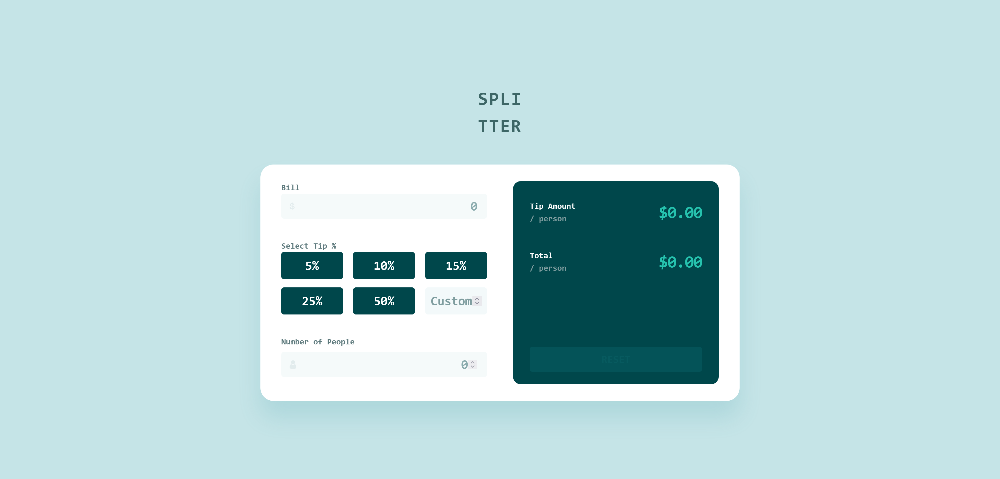
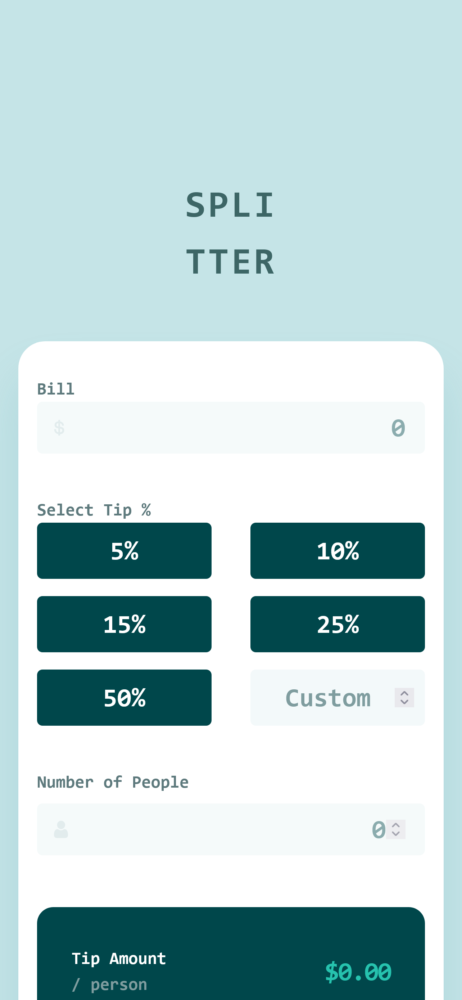

## Tip Calculator App — Frontend Mentor Challenge

A responsive, accessible tip calculator built with semantic HTML, modular SCSS architecture, and vanilla JavaScript. This project reinforces core engineering fundamentals including input handling, state-based rendering, and architecture separation — using a lightweight MVC pattern to mirror modern frontend frameworks like Angular.

[🔗 Live Demo](https://kellenkjames.github.io/tip-calculator-app/)

---

## Features

- Real-time tip calculation based on bill, tip %, and number of people
- Responsive UI using **flexbox**
- Predefined tip options + custom tip entry
- Inline form validation and error handling for edge cases (e.g., zero people)
- Reset button with disabled state logic until inputs are active
- Modular JS files with **MVC-lite architecture**:
  - `model.js` for calculations + state
  - `view.js` for rendering logic
  - `controller.js` for app orchestration
- SCSS system with **design tokens, mixins, and component-based structure**
- Keyboard-friendly, accessible UX with semantic labels and focus states

---

## Tech Stack

- HTML5
- SCSS (Tokens, BEM, Mixins, Responsive Layout)
- JavaScript (ES6 Modules, MVC-lite architecture)
- Git / GitHub
- GitHub Pages (Deployment)
- Figma (Design Reference)

---

## Screenshots

| Desktop                                                     | Mobile                                                    |
| ----------------------------------------------------------- | --------------------------------------------------------- |
|  |  |

---

## Project Structure

<pre>
tip-calculator-app/
├── index.html
├── style.css                 # Compiled CSS output
├── style.scss                # Main SCSS file
├── /scss
│   ├── abstracts/            # _variables.scss, _mixins.scss
│   ├── base/                 # _reset.scss, _typography.scss
│   ├── layout/               # _grid.scss, _container.scss
│   ├── components/           # _form.scss, _button.scss, _output.scss
│   └── main.scss             # SCSS entry point
├── /js
│   ├── model.js              # Calculation logic + state
│   ├── view.js               # DOM selection + rendering
│   ├── controller.js         # Event handlers and flow control
│   └── main.js               # App entry point
├── /assets
│   ├── images/               # Design icons and assets
│   └── screenshots/          # Screenshots for README
├── .gitignore
└── README.md
</pre>

---

## Getting Started

1. Clone the repository:
   `git clone https://github.com/yourusername/tip-calculator-app.git`

2. Navigate to the project folder:
   `cd tip-calculator-app`

3. Compile SCSS to CSS (if using the CLI):
   `sass scss/main.scss style.css`

4. Open `index.html` in your browser to run the app.

---

## ⏱️ Time Estimates

| Task                                   | Time Spent    |
| -------------------------------------- | ------------- |
| Initial Setup & File Scaffolding       | 1.5 hrs       |
| HTML & Layout Structure (Mobile-First) | 2 hrs         |
| SCSS Architecture & Design Tokens      | 2 hrs         |
| MVC Logic & Input Event Handling       | 3 hrs         |
| Validation, Reset Logic, QA            | 2 hrs         |
| Final Polish (Docs, Accessibility)     | 1 hr          |
| **Total**                              | **~11.5 hrs** |

---

## Key Learnings

- **Input-based UI logic** and dynamic calculation with clean state separation
- Applying MVC principles in a vanilla JS app to mirror Angular component flow
- Writing **pure functions** for business logic with reusable utility structure
- Enforcing **consistent spacing, tokens, and responsive rules** via SCSS mixins
- Strengthening architecture and layout instincts by balancing grid and flexbox
- Improving form accessibility with proper input-label structure and focus behavior

---

## Improvements (If time allowed)

- Add animations or transitions to enhance visual feedback
- Use `Intl.NumberFormat` for better currency formatting
- Implement keyboard navigation across tip buttons
- Add light/dark mode toggle using CSS custom properties
